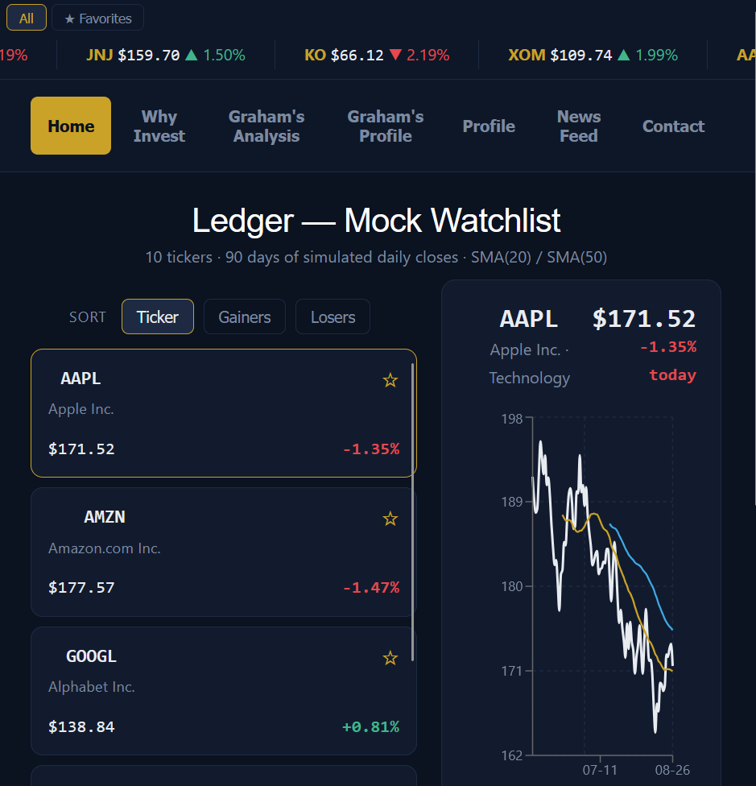
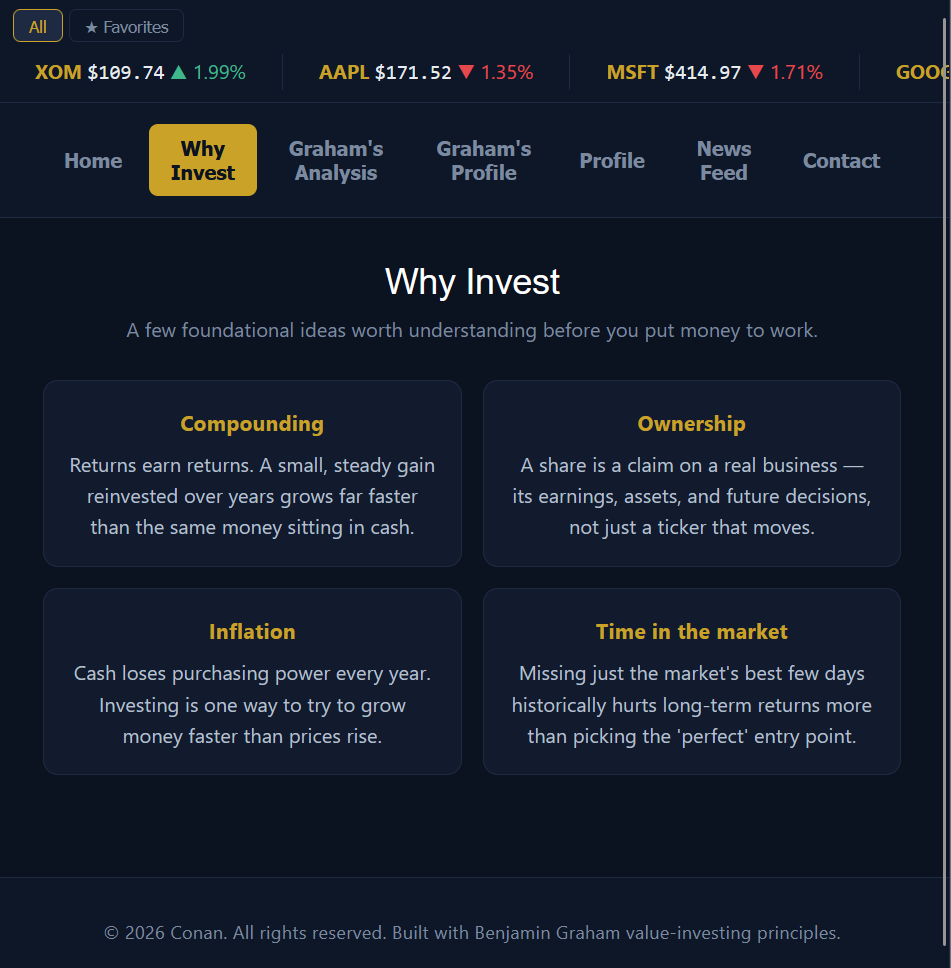
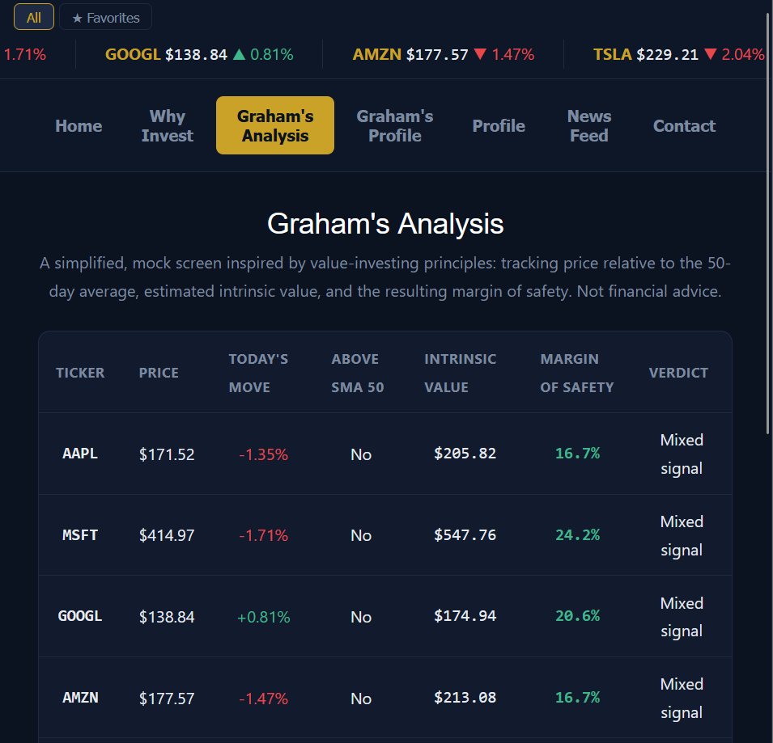
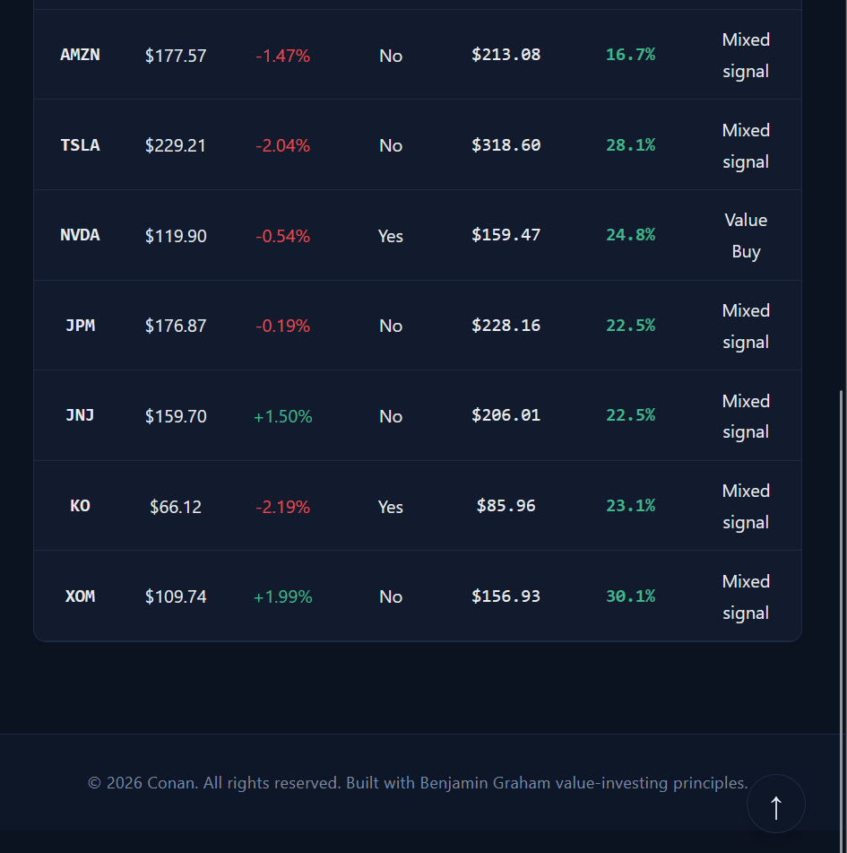
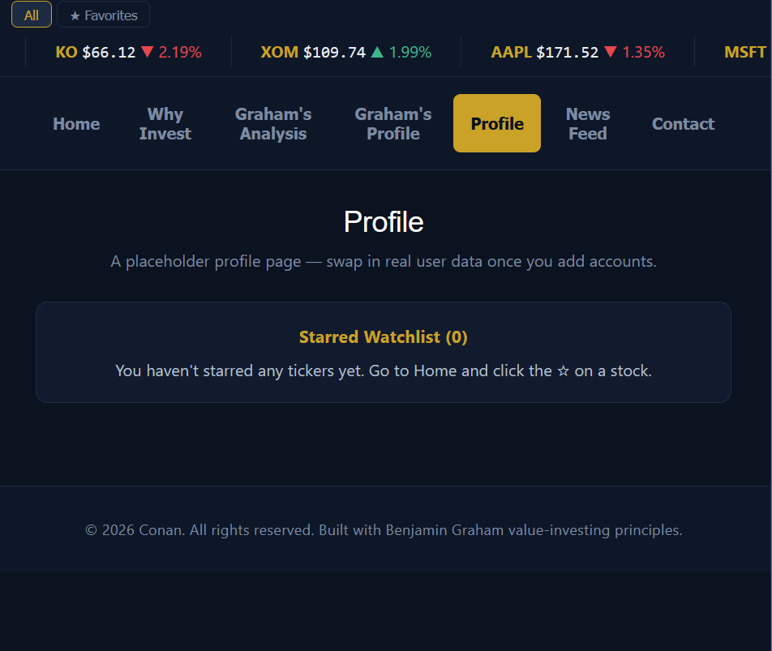
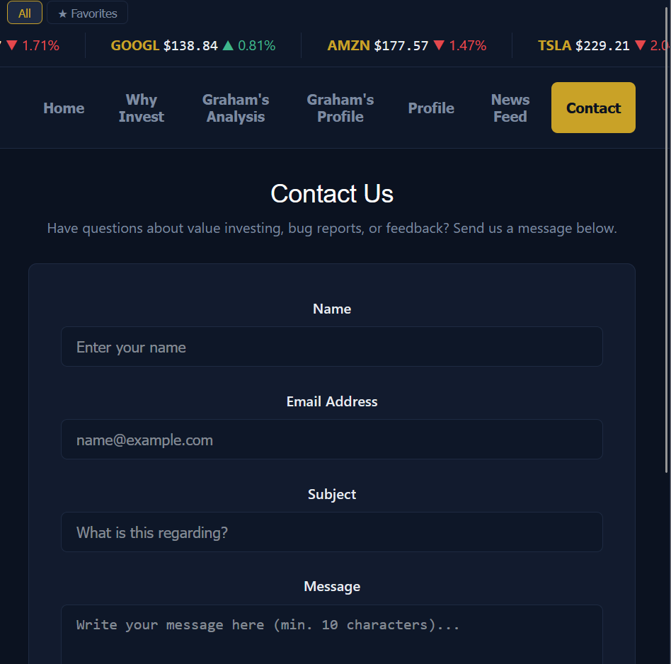
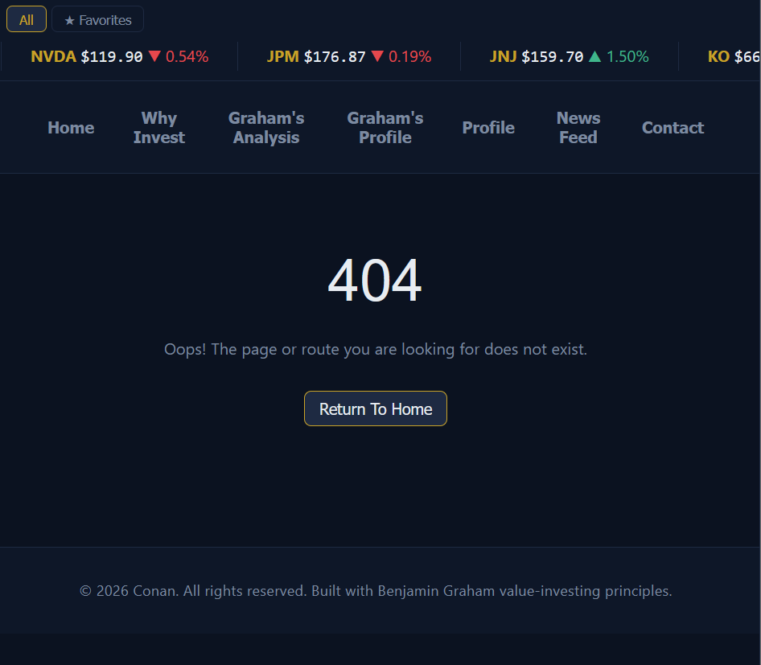

<h1> 📈 Benjamin Graham Stock Analyzer </h1>

<h3> 📝 <u> Project Description </u></h3>

The Benjamin Graham Stock Analyzer is a React-based web applicaiton designed to help investors evaluate stocks using Benjamin Graham's timeless principles. This app calculates the intrinsic value, tracks watchlists, updates market news and provide graphical analysis of the stock that the user is interested in. It helps the users make sound, defensive investment decisions.

<h3> 🚀 <u> Technologies Used </u></h3>

Frontend: React (Hooks: useState, useMemo, useState)
 
Styling: CSS / Modern Flexbox & Grid

State Management: React component state & native set objects for watchlists

Tooling: Vite

<h3> 🛠️ <u> Setup and Installation </u> </h3>

Instructions:
1. Clone the repository:
```bash
git clone https://github.com/your-username/your-repo-name.git
```
2. Navigate to the project directory: 
```bash 
cd your-repo-name
```
3. Install dependencies:
```bash
npm install
```
4. Run the development server: 
```bash
npm run dev
```
5. Open your browser:
Navigate to http://localhost:5173 (or the port you specified in your terminal)


<h3> 🌐 <u> Live Demo </u></h3>

🚀 Check out the live deployment of the application here 🚀:
<p align="center">
  <a href="http://localhost:5173/" target="_blank">
    <p>👉  Click Here to View Live Demo </p>
  </a>
</p>

<h3> 📸 <u> Screenshots </u></h3>

| <div align="center"> <br><h3><strong>Home Page</strong></h3></div> | <div align="center"> <br><h3><strong>Why do we invest?</strong></h3></div> |
| :---: | :---: |
| <div align="center"> <br><h3><strong>Graham's Analysis</strong></h3></div> | <div align="center"> <br><h3><strong>Showcasing the scroll to top button</strong></h3></div> |
| <div align="center"> <br><h3><strong>Graham's Profile</strong></h3></div> | <div align="center"> <br><h3><strong>User's profile</strong></h3></div> |
| <div align="center"> <br><h3><strong>News Feed</strong></h3></div> | <div align="center"> <br><h3><strong>Contact Us</strong></h3></div> |
| <div align="center"> <br><h3><strong>Error page</strong></h3></div> 
